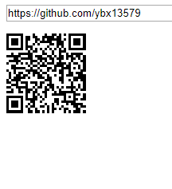

# QRCode.js
QRCode.js是用于制作QRCode的JavaScript库。QRCode.js支持在DOM中使用HTML5画布和表格标签的跨浏览器。

QRCode.js没有依赖关系。

 - 效果图
 
  
## 基本用法
```
<div id="qrcode"></div>
<script type="text/javascript">
new QRCode(document.getElementById("qrcode"), "http://jindo.dev.naver.com/collie");
</script>
```

或

```
<div id="qrcode"></div>
<script type="text/javascript">
var qrcode = new QRCode(document.getElementById("qrcode"), {
	text: "http://jindo.dev.naver.com/collie",
	width: 128,
	height: 128,
	colorDark : "#000000",
	colorLight : "#ffffff",
	correctLevel : QRCode.CorrectLevel.H
});
</script>
```

你可以使用一些方法

```
qrcode.clear(); // clear the code.
qrcode.makeCode("http://naver.com"); // make another code.
```

## 浏览器兼容性
IE6~10, Chrome, Firefox, Safari, Opera, Mobile Safari, Android, Windows Mobile, ETC.

## License
MIT License

## 联系
twitter @davidshimjs


